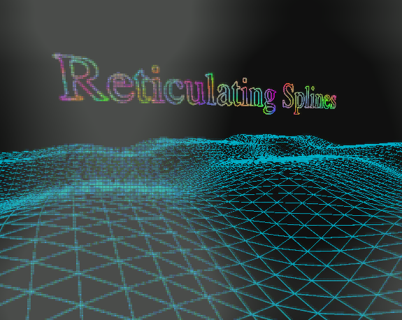

# Reticulating Splines

[An art.](https://ipfs.io/ipfs/Qmd3a2eeSWKFJHs66HszDncs2qcYPHZi8exYFSvuRAxTxE)

[](https://ipfs.io/ipfs/Qmd3a2eeSWKFJHs66HszDncs2qcYPHZi8exYFSvuRAxTxE)

To install:

You need Browserify:

```
sudo npm install -g browserify
```

Than you can clone the rep and:

```
npm install
npm run build
```

Then point your browser at `build/index.html`.

## Development

Set up watching:

```
sudo npm install -g watchify
npm run watch
```

Then edit and refresh.

